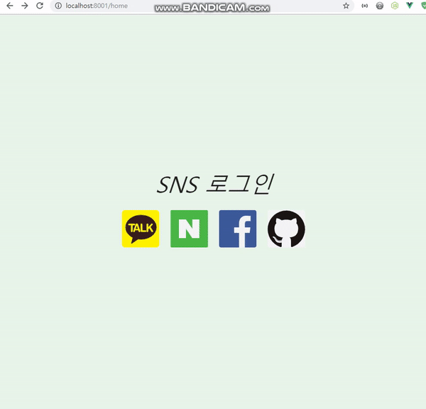

## SNS 로그인 구현하기

카카오, 네이버, 페이스북, 깃헙 등 소셜 로그인을 구현해보았습니다. 데이터베이스는 MySQL 8.0을 사용하였으며 Sequelize ORM을 이용하여  메서드로 쿼리를 조작하였습니다.


## 사용 기술들

Front End : Vue.js 프레임워크, Vuetify

Back End : Express 프레임워크, Sequelize 5.18 , Passport-(kakao, naver, facebook, github), mysql2

DataBase : RDBMS MySQL 8.0


## 결과




## 겪은 이슈들

### Axios 소셜 로그인 요청

axios로 소셜로그인 요청시 다음과 같은 에러가 났습니다.

```
Access to XMLHttpRequest at 

'https:// ... 소셜홈페이지 인증 URL ...' 

(redirected from 'http://localhost:8001/api/auth/kakao') from origin 'null' has been blocked by CORS policy: No 'Access-Control-Allow-Origin' header is present on the requested resource.
```

CORS에러가 났기에 처음에는 서버에서 Access-Control-Allow-Origin 처리를 해주었습니다. 그러나 이는 당연히 되지 않았습니다. 해당오류는 **localhost:8001에서 부터 Redirect된 인증페이지**의 Access-Control-Allow-Origin 속성이 없기 때문에 우리 서버의 localhost:8001에서 cors 처리를 해도 소용이 없었습니다. 해결방법으로는 저는 a 태그의 href 속성을 이용해서 이러한 문제를 해결했습니다.

```
<a href="api/auth/kakao">
```


## 실행

npm 모듈을 설치합니다.

```bash
$ cd server
```

```bash
$ npm install
```


다음으로 MySQL에 접속하기 위한 config.json이 필요합니다.  config폴더를 생성하고 config.json을 생성합니다. (server/config/config.json)

```json
config.json, 개발모드로 진행
{
  "development": {
    "username": MYSQL아이디,
    "password": MYSQL비밀번호,
    "database": "github",
    "host": "127.0.0.1",
    "dialect": "mysql",
    "operatorsAliases": false
  },
}
```

config 설정이 끝나면 Sequelize-cli 명령어를 이용하여 db를 생성합니다

```
$ sequelize create:db
```


다음으로 비밀키를 저장할 .env를 생성합니다 (server/.env)

```
COOKIE_SECRET=MYCAMP
PORT=8001
KAKAO_ID=카카오 RESTFUL API 키
NAVER_ID=네이버 API키
NAVER_SECRET=네이버 비밀키
FACEBOOK_ID=페북 API키
FACEBOOK_SECRET=페북 비밀키
GITHUB_ID=깃헙 API키
GITHUB_SECRET=깃헙 비밀키
```

개발자 홈페이지에서 웹 앱을 등록하고 API키와 비밀키를 입력합니다. 그리고 개발자 홈페이지에서 사이트 도메인주소는 http://localhost:8001, Redirect URL은 http://localhost:8001/api/auth/{SNS}/callback 으로 설정해줍니다.


환경설정이 끝나면 서버를 구동합니다.

```bash
$ npm start
```

localhost:8001로 접속합니다.

